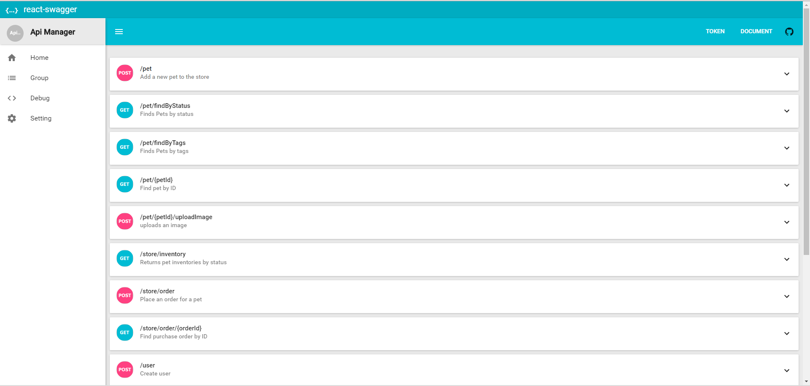

# react-swagger

## Installation

After cloning the repository, install dependencies:
```sh
npm install
```

Now you can run your local server:
```sh
npm run dev
```
[Demo](https://react-swagger.herokuapp.com)

